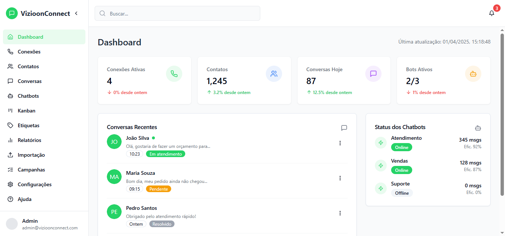
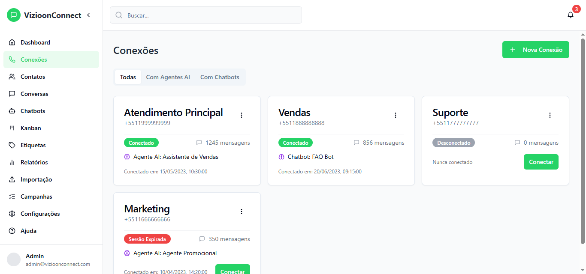
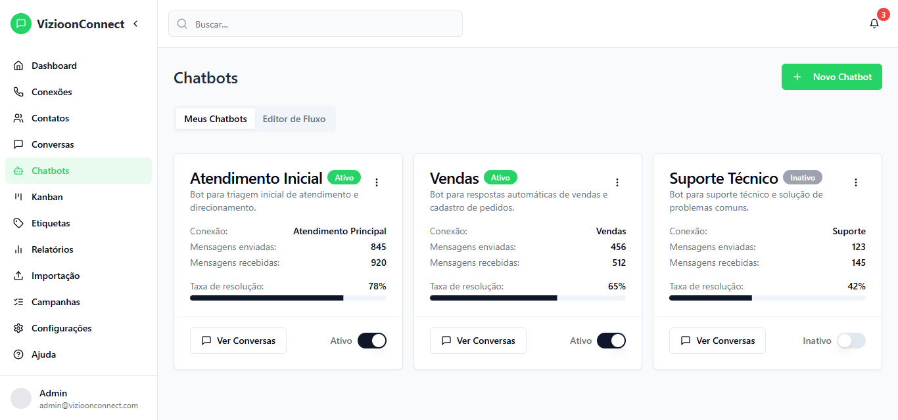
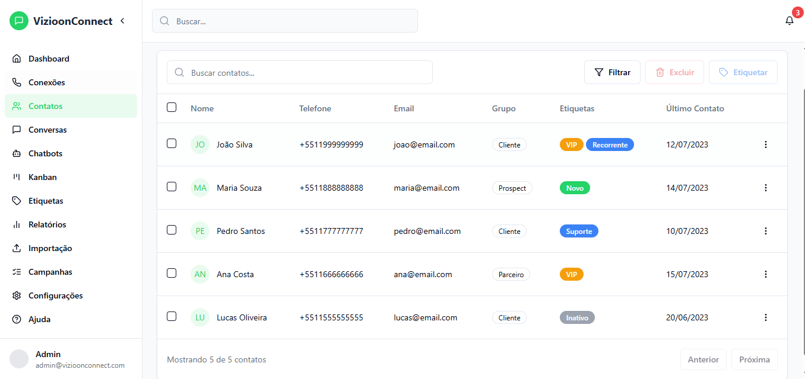

# VIZIOONZAPUI


Um painel administrativo completo para gerenciamento de WhatsApp, desenvolvido com tecnologias modernas de front-end.

## 📷 Screenshots

Aqui estão algumas capturas de tela do VIZIOONZAPUI em ação:

### Dashboard Principal

*Visão geral com estatísticas e status de conexões*

### Gerenciamento de Conexões

*Interface para adicionar e gerenciar múltiplas conexões de WhatsApp*

### Configuração de Bots

*Crie e configure bots de atendimento automático*

### Gerenciamento de Contatos

*Importe e organize seus contatos com facilidade*

## 📋 Sobre o Projeto

VIZIOONZAPUI é uma interface de usuário moderna e intuitiva para gerenciar múltiplas conexões de WhatsApp, importar e gerenciar contatos e configurar bots de atendimento automático. Este projeto é inspirado em soluções como WhaTicket e Izing, mas com foco em uma experiência de usuário aprimorada e design moderno.

### 🚀 Funcionalidades

- **Dashboard Completo:** Visualize estatísticas e informações importantes sobre suas conexões
- **Gerenciamento de Conexões:** Adicione, edite e monitore múltiplas conexões de WhatsApp
- **Importação de Contatos:** Importe contatos em massa de arquivos CSV ou Excel
- **Gerenciamento de Contatos:** Organize seus contatos com tags e informações detalhadas
- **Bots de Atendimento:** Configure respostas automáticas para mensagens com base em palavras-chave
- **Interface Responsiva:** Acesse o painel de qualquer dispositivo com design adaptável

## 🛠️ Tecnologias Utilizadas

Este projeto foi desenvolvido com as seguintes tecnologias:

- **React:** Biblioteca JavaScript para construção de interfaces
- **TypeScript:** Superset JavaScript que adiciona tipagem estática
- **Vite:** Build tool moderna e rápida para desenvolvimento web
- **Tailwind CSS:** Framework CSS utilitário para design rápido e consistente
- **shadcn/ui:** Componentes de UI reutilizáveis e estilizáveis
- **Lucide React:** Biblioteca de ícones leves e bonitos

## 🔧 Instalação e Execução

Siga os passos abaixo para configurar o ambiente de desenvolvimento:

```bash
# Passo 1: Clone o repositório
git clone https://github.com/dvizioon/VIZIOONZAPUI.git

# Passo 2: Navegue até o diretório do projeto
cd VIZIOONZAPUI

# Passo 3: Instale as dependências necessárias
npm i

# Passo 4: Inicie o servidor de desenvolvimento
npm run dev
```

Após esses passos, o aplicativo estará rodando localmente, geralmente em [http://localhost:5173](http://localhost:5173).

## 📁 Estrutura do Projeto

O projeto está organizado da seguinte forma:

```
VIZIOONZAPUI/
│
├── src/                    # Código fonte do projeto
│   ├── components/         # Componentes reutilizáveis
│   ├── pages/              # Páginas da aplicação
│   ├── contexts/           # Contextos do React
│   ├── hooks/              # Hooks personalizados
│   ├── services/           # Serviços e APIs
│   ├── styles/             # Estilos globais
│   ├── utils/              # Funções utilitárias
│   ├── App.tsx             # Componente principal
│   └── main.tsx            # Ponto de entrada
│
├── public/                 # Arquivos públicos
├── index.html              # HTML principal
├── package.json            # Dependências e scripts
├── vite.config.ts          # Configuração do Vite
└── README.md               # Este arquivo
```

## 🖥️ Interface

O projeto possui uma interface moderna e intuitiva, com as seguintes telas principais:

- **Dashboard:** Visão geral com estatísticas e informações importantes
- **Conexões:** Gerenciamento de instâncias do WhatsApp
- **Contatos:** Importação e gerenciamento de contatos
- **Bots:** Configuração de respostas automáticas
- **Configurações:** Ajustes gerais do sistema

## 🔄 Integrações Futuras

O projeto está sendo desenvolvido apenas com o front-end por enquanto, mas planeja integrar com:

- API de backend personalizada para persistência de dados
- Integração direta com a API oficial do WhatsApp Business Official e Não Official
- Suporte a múltiplos idiomas
- Sistema de análise e relatórios avançados

## 📜 Licença

Este projeto está licenciado sob a licença MIT. Veja o arquivo `LICENSE` para mais detalhes.

## 🤝 Contribuição

Contribuições são bem-vindas! Para contribuir:

1. Faça um fork do projeto
2. Crie uma branch para sua feature (`git checkout -b feature/AmazingFeature`)
3. Commit suas mudanças (`git commit -m 'Add some AmazingFeature'`)
4. Push para a branch (`git push origin feature/AmazingFeature`)
5. Abra um Pull Request

## 📧 Contato

VIZIOON - [contato@vizioon.com.br](mailto:contato@vizioon.com.br)

Link do projeto: [https://github.com/dvizioon/VIZIOONZAPUI](https://github.com/dvizioon/VIZIOONZAPUI)